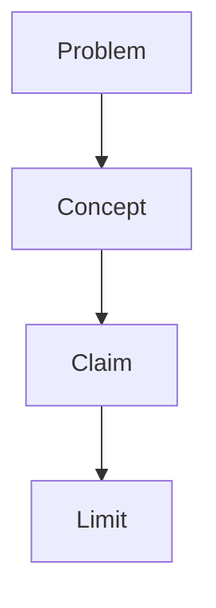

# Output Formats

Default to a `.md` file written in plain Markdown. Before drafting, confirm the note language and ask whether the user wants portable Markdown enhancements. Mention that `.md` notes work well across several tools: Obsidian for long-term knowledge bases, backlinks, tags, concept hubs, and graph-style retrieval; Typora for local reading and export; GitHub/GitLab for publishing and collaboration; and VS Code with Mermaid preview extensions for project-based notes.

## Markdown

Markdown output must be platform-neutral:

- standard headings
- paragraphs
- lists
- tables where useful
- block quotes for source passages
- Mermaid only when it clarifies structure
- a references section at the end when scholarly sources are used, titled in the chosen note language

Do not use:

- YAML properties
- Obsidian-only links as the only label for a concept
- plugin-dependent syntax
- excessive callouts
- highlight syntax that will look broken outside Obsidian

## Portable Markdown Enhancements

Enhanced output remains valid Markdown with restrained additions. It should still be readable in any Markdown viewer.

Recommend enhancements when the user is building a long-term knowledge base, wants concept links, studies recurring topics, keeps notes across multiple articles, may later search and connect ideas, wants to publish notes, or wants diagrams to render in tools that support Mermaid.

Tool guidance:

- Obsidian: best for knowledge bases, backlinks, tags, concept hubs, and graph-style retrieval.
- Typora: best for local reading, visual editing, and export to formats such as PDF or HTML.
- GitHub/GitLab: best for publishing, repository documentation, collaboration, and Mermaid-rendered diagrams in project contexts.
- VS Code: best for project-based notes alongside code, especially with Markdown and Mermaid preview extensions.

Optional YAML properties:

```yaml
---
title:
discipline:
material_type:
mode: notes
output_format: obsidian
tags:
---
```

Rules:

- Use YAML properties only when they help retrieval and the target tool supports them.
- Use tags sparingly and make them general enough to reuse.
- Use wiki links such as `[[double links]]` only when the user wants Obsidian-style linking. Keep a readable label when needed: `[[concept-id|readable concept]]`.
- Do not make every keyword a link.
- Mermaid diagrams are optional and should show conceptual or argumentative structure, not decorate.
- A related-notes section may suggest possible future links, but must not pretend those notes already exist.
- Avoid plugin-specific callouts, CSS classes, Dataview blocks, or custom highlight colors unless the user explicitly asks for that vault's conventions.

## Presentation Pattern

For substantial notes, use a polished study-note rhythm:

1. Begin with a clear title.
2. Add a short reading path that names the discipline, material type, and route through the problem.
3. Use one to three opening paragraphs to orient the reader: what problem the material answers, why it matters, which source or argument controls the structure, and what misunderstanding to avoid.
4. Let main sections advance by problem, concept, argument, method, evidence, or historical development rather than by page order.
5. Place short source passages inside the relevant section, then explain what the passage establishes, distinguishes, proves, complicates, or motivates.
6. Use Mermaid diagrams only for dense argument structures, concept genealogies, timelines, systems, or method flows.
7. End complex notes with an argument summary or key takeaways.
8. Add a key concept table when the note contains many concepts, distinctions, schools, methods, variables, or terms the user may revisit.

The closing summary and concept table are retrieval aids. They should be compact and should not replace the main prose reconstruction.

## Source Passages And Quotations

Use block quotes only for short passages that matter for the concept, evidence, or argument.

Plain Markdown pattern:

```markdown
> Short source passage. (Source location, if verified)

Explanation: explain how the passage functions in the argument.
```

Rules:

- Locate quotations to the work and preferably the chapter, section, page, paragraph, or other stable locator when available.
- If the location cannot be verified, paraphrase instead of quoting.
- Do not quote source text as a decorative motto.
- Do not attach page-ledger language unless the user asks for an audit version.

## Diagrams

Use diagrams when they reduce cognitive load:

- concept maps
- argument structures
- timelines
- framework matrices
- theory-position maps
- system or method flow

Avoid diagrams when the material is simple, when a table is clearer, or when the diagram would repeat the prose.

Prefer `flowchart TD` or `flowchart LR` for compatibility:

````markdown

````
